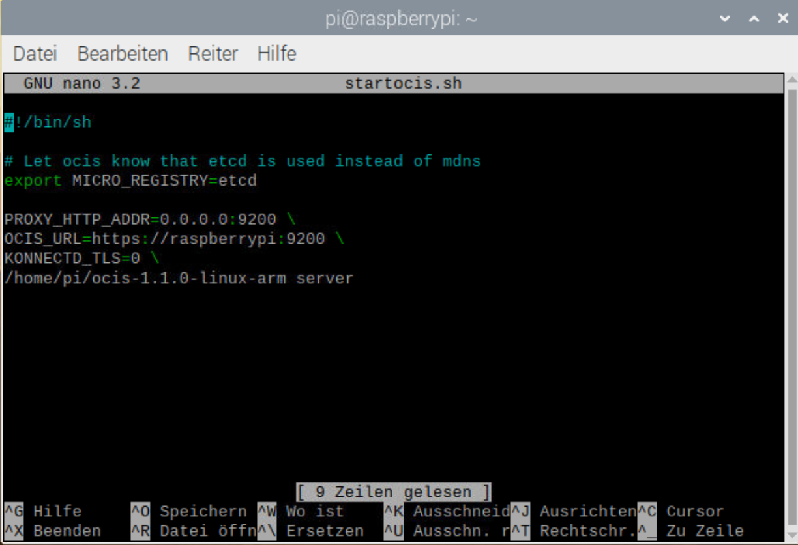

# Werkstattauftrag W08 OwnCloud

## Autoren, Versionierung des Dokumentes

   • Autoren: Altin Maliqaj & Patrik Pribela
   
   • Mail: altin.maliqaj@edu.tbz.ch | patrik.pribela@edu.tbz.ch

   • Version: 1.0 (Vollständige Edition)
- - -
## Inhaltsvezeichnis
- - [Werkstattauftrag W08 OwnCloud](#werkstattauftrag-w08-owncloud)
  - [Autoren, Versionierung des Dokumentes](#autoren-versionierung-des-dokumentes)
  - [Einführung](#einführung)
    - [Beschreibung: Welche Funktionen wird der Service erfüllen](#beschreibung-welche-funktionen-wird-der-service-erfüllen)
      - [OwnCloud Infinite Scale](#owncloud-infinite-scale)
    - [Vorgesehener Zeitaufwand für die Realisierung](#vorgesehener-zeitaufwand-für-die-realisierung)
    - [Stolpersteine](#stolpersteine)
  - [Benötigte Hard- und Software](#benötigte-hard--und-software)
    - [Hardware (Materialliste, Funktionalität)](#hardware-materialliste-funktionalitaet)
    - [Software (Anforderungen, Firmware, OS-Image, ergänzende SW-Packages, Abhängigkeiten, Funktionalität)](#software-anforderungen-firmware-os-image-ergaenzende-sw-packages-abhängigkeiten-funktionalitaet)
  - [Installationsanleitung (Lösungsweg)](#installationsanleitung-lösungsweg)
    - [Raspberry Pi Betriebssystem updaten ](#raspberry-pi-betriebssystem-updaten)
    - [etcd installieren](#etcd-installieren)
    - [OwnCloud Infinite Scale Binary herunterladen und ausführen](#owncloud-infinite-scale-binary-herunterladen-und-ausführen)
    - [Zugreifen](#zugreifen)
    - [Cronjob für Startskript erstellen (Optional)](#cronjob-für-startskript-erstellen-optional)
  - [Qualitätskontrolle (Prüfen der Funktionalität mit Ablauf von Kommandos und entsprechenden Outputs)](#qualitätskontrolle-prüfen-der-funktionalität-mit-ablauf-von-kommandos-und-entsprechenden-outputs)
  - [Error-Handling](#error-handling)
    - [Allgemeine Schritte vor weiterem Debugging zwingend ausführen](#allgemeine-schritte-vor-weiterem-debugging-zwingend-ausführen)
    - [Logs von CRON auslesen](#logs-von-cron-auslesen)
  - [Quellen](#quellen)
  - [Hilfe](#hilfe)
- - - 
## Einführung
In der folgenden Dokumentation ist die Installation, sowie Konfiguration samt allen Anforderungen von OwnCloud dokumentiert.

   ### Beschreibung: Welche Funktionen wird der Service erfüllen
   OwnCloud ist Ihre eine eigene private Cloud zum Austausch von Dateien. Die wichtigsten Features und Funktionen von OwnCloud sind die Bereitstellung von Clients, Synchronisation, ActiveDirectory-Anbindung, Verschlüsselung und viele andere. Es wird angestrebt diese auf allen Plattformen betreiben zu können.

   #### OwnCloud Infinite Scale
   Das Ziel bei der Entwicklung der neuen OwnCloud Instanz ist die **unendliche Skalierung**, daher der Name.
   **Unendliche Skalierung** bedeutet eine unendliche Anzahl von Dateien, Benutzern und Maschinen sowie unendliche Dateigrößen. Diese wird in Go geschreiben, was OwnCloud plattformunabhängig macht. OwnCloud Infinite Scale benötigt weder Apache noch eine PHP-Infrastruktur und ist damit die am einfachsten zu bedienende und am leichtesten zu implementierbare OwnCloud aller Zeiten. Diese ist natürlich Open Source, lizenziert unter Apache 2.0. Es werden Microservices verwendet und eine dreistufige Architektur, was OwnCloud zu einer sicheren, cloud-nativen Lösung für Dateizugriffsanforderungen macht. Einige weltweit bekannte Forschungsinstitute sind an der Entwicklung von OwnCloud Infinite Scale beteiligt und stellen sicher, dass es ihre und Ihre Möglichkeiten erweitert, indem es eine beispiellose Skalierung bietet.

   ### Vorgesehener Zeitaufwand für die Realisierung
   Der Zeitaufwand beträgt unserer Schätzung nach 60 Minuten im Durchschnitt. Die Schätzung kann wegen Hardware-Build, Software-Version und Netzwerkanbindung abweichen.

   ### Stolpersteine
   Bei folgendem Projekt können mehrere **Stolpersteine** aufkommen, welche uns, sowie anschliessend Sie an einer erfolgreichen Umsetzung hindern können oder diese zumindest erschweren können. Um den gägnigsten **Stolpersteinen** aus dem Weg gehen zu können, wurden diese aufgelistet.  
   **• Veraltete Version des Raspberry Pi** 
   Falls sich der Raspberry Pi nicht aktualisieren lässt und/oder die Hardware veraltet ist, kann (muss nicht!) es vorkommen, dass es zu Problemen bezüglich Kompatibilität führt. Wir empfehlen in einem solchen Fall eine virtuelle Maschine zu erstellen und das Raspbian OS aufzusetzen. 
   **• Restriktionen des (TBZ) Netzwerks** 
   Da öffentliche Netzwerke oft viele Sicherheitsmassnahmen eingepflegt erhalten, besteht die Möglichkeit, dass immer wieder Ports, welche essentiell für eine Anwendung sind, blockiert werden. Es gilt die Empfehlung bei Home Office Möglichkeit diese zu nutzen und aus dem Heimnetzwerk aus zu arbeiten. 
- - -
## Benötigte Hard- und Software
   ### Hardware (Materialliste, Funktionalität)
   • Raspberry Pi 
   • Monitor + Peripherie (Maus und Tastatur) 
   • ggf. Netzwerkperipherie (Kabel, Switch)
   ### Software (Anforderungen, Firmware, OS-Image, ergänzende SW-Packages, Abhängigkeiten, Funktionalität)
   • Neuste OS Version von Raspberry Pi inkl. Updates 
- - -
## Installationsanleitung (Lösungsweg)
### Raspberry Pi Betriebssystem updaten 
Nach dem Sie den Raspi mit SD Karte von der Lehrperson erhalten haben, führen Sie als erstes die Betriebssystem Updates aus. So können Sie jegliche veraltete Systemfehler meiden. Dies machen Sie mit folgenden Befehlen im Terminal: 
`sudo apt-get update` 
`sudo apt-get upgrade`

### etcd installieren
etcd ist ein stark konsistenter, verteilter Key-Value-Speicher, der eine zuverlässige Möglichkeit zum Speichern von Daten bietet, auf die ein distributed System oder ein Cluster von Rechnern zugreifen muss. In unserem Fall wird dieser verwendet, um den Service zu registrieren. 
`sudo apt-get install etcd` 
Anschliessend muss die Konfigurationsdatei angepasst werden, damit die Funktionalität von **etcd** gewährleistet werden kann. 
`nano /etc/default/etcd` 
Am Ende von */etc/default/etcd* müssen wir die folgende Zeile hinzufügen. 
`ETCD_UNSUPPORTED_ARCH=arm` 
Zu guter letzt muss noch der Service gestartet werden. Ebenfalls geben wir dem System mit, dass der Service bei jedem Start automatisch gestartet wird. 
`sudo service etcd start` 
`sudo service etcd enable`
### OwnCloud Infinite Scale Binary herunterladen und ausführen
Nun begeben wir uns in das Homeverzeichnis des Users pi. 
`cd ~` 
Als erstes muss man den Build vom Downloadserver herunterladen. 
`curl https://download.owncloud.com/ocis/ocis/1.1.0/ocis-1.1.0-linux-arm --output ocis-1.1.0-linux-arm` 
Sobald der Build heruntergeladen wurde, muss man diesen ausführen. Damit dies klappt muss folgender Befehl eingegeben werden: 
`chmod 755 ./ocis-1.1.0-linux-arm` 
Nun erstellen wir ein Skript, welches die OwnCloud Instanz startet. 
`touch startocis.sh` 
Das eben erstellte Skript bearbeiten wir mit einem Editor und fügen die benötigte Konfiguration ein. Dem Skript muss mitgegeben werden, dass etcd verwendet wird. 
`nano startocis.sh` 
 
An dieser Stelle müssen wir das eben erstelle Skript abspeichern und ausführbar machen  
` sudo chmod 755 startocis.sh` 
Am Ende führen wir das Skript aus um die OwnCloud Instanz zu starten 
`sudo ./startocis.sh`
### Zugreifen
Die Installation ist hiermit abgeschlossen. Sie dürfen den Zugriff auf das Web-Interface von Ihrer OwnCloud Instanz testen. 
`https://<hostname>:9200`
### Cronjob für Startskript erstellen (Optional)
Damit die Instanz nicht bei jedem Hochfahren des Raspberry manuell gestartet werden muss, richten wir einen Cronjob ein. Wir lassen das Startskript alle 5 Minuten laufen. Den Cronjob richten wir im Kontext des root Benutzers ein, damit das Skript vollständig ausgeführt wird. 
`sudo crontab -e` 
In der Konfigurationsdatei von Cron fügen wir nun die folgende Zeile ein: 
`*/5 * * * * /bin/bash /home/pi/startocis.sh` 
Sobald das File gespeichert wird, starten wir den Cron Service neu, um die Änderungen wirksam zu machen. 
`sudo service cron restart`
- - -
## Qualitätskontrolle (Prüfen der Funktionalität mit Ablauf von Kommandos und entsprechenden Outputs)
• Erreichbarkeit des Web-Interface im Browser prüfen 
`https://"hostname":9200` 
• Cron Logs auslesen und prüfen, ob das Startskript ausgeführt wurde 
`sudo grep CRON /var/log/syslog`
- - -
## Error-Handling
Falls die Installation am Ende nicht ordnungsgemäss funktioniert, kann dies mehrere Gründe haben. Weiter unten finden Sie die gängigsten Fehler aufgelistet.
### Allgemeine Schritte vor weiterem Debugging zwingend ausführen
• Raspberry Pi neu starten 
• Prüfen, ob der Dienst der Anwendung läuft 
• Netzwerkverbindung prüfen 
• Restriktionen im Netzwerk ausschliessen
### Logs von CRON auslesen
Falls der Verdacht besteht, dass der Cronjob nicht oder nicht korrekt ausgeführt wurde, kann man dies in den Logs prüfen. Das allgemeine Logfile kann man mit folgendem Befehl auslesen. 
`sudo grep CRON /var/log/syslog` 
Wird man aus dem Syslog nicht schlau, so kann man auch für einen Cronjob zwei spezifische Logfiles anlegen und diese anschliessend auslesen. Den Parameter setzt man beim Cronjob selbst. So kann dieser anschliessend aussehen: 
`*/5 * * * * /bin/bash /home/pi/startocis.sh 1> /home/pi/log.txt 2> /home/pi/err.txt` 
Wie der Parameter schon sagt, differenziert man zwischen Log-, und Errorfile in diesem Beispiel.
- - -
## Quellen
• [Offizielle Installationsanleitung von OwnCloud](https://owncloud.com/de/news/howto-owncloud-infinite-scale-on-a-raspberry-pi/) 
• [etcd Dokumentation](https://etcd.io/docs/v3.5/) 
- - -
## Hilfe
• [Crontab Generator](https://crontab-generator.org/) 
- - -